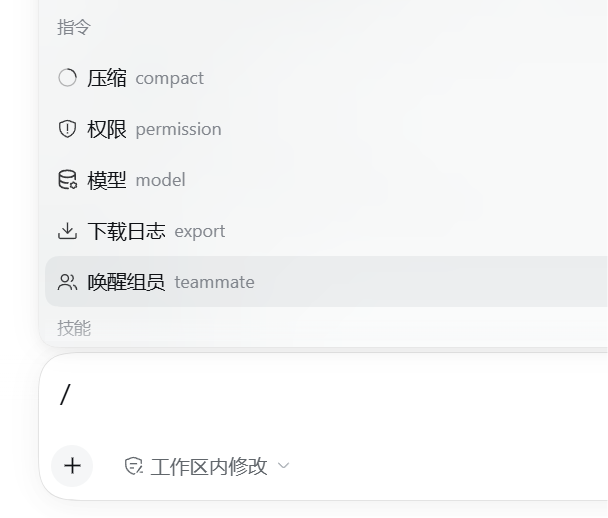
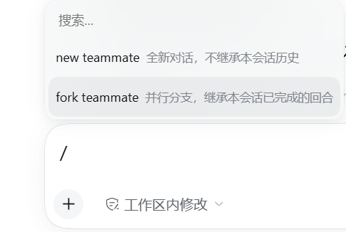

# dsh-sidefork-a-teammate

[中文](#中文) ｜ [English](#english)

给 [DeepSeek Harness](https://github.com/deepseek-ai/deepseek-harness) 加一条**由人手动触发**的 `/teammate` 入口：不必先让模型去调 `spawn_teammate`，你自己就能从输入框拉起一个组员（teammate）。

> 命令面**只有这一条** `/teammate`，选中后先选模式（`new teammate` / `fork teammate`），再填一行 `名字 | 描述 | 任务` 提交。
> **不进模型上下文、不计 token**。





> ☝️ 真实截图：左侧命令面板里这一行显示为 **「唤醒组员 teammate」**（本地化标题 + 命令名作别名）；选中后弹出两个模式，
> 文案就是 **`new teammate` 全新对话，不继承本会话历史** 与 **`fork teammate` 并行分支，继承本会话已完成的回合**。

---

## 中文

### 一条命令、两级入口

1. 输入框敲 **`/teammate`** —— 命令菜单里**只有它**；
2. 选中后弹**模式选择**：`new teammate` / `fork teammate`；
3. 选中模式后弹**自绘输入弹窗**，填一行 `名字 | 描述 | 任务`，提交即创建。

### `new teammate` 与 `fork teammate` 到底差在哪（重点）

两者都是"拉起一个组员"，差别只有一个：**新组员要不要继承你这边的对话历史**。这一个差别决定了它们的适用场景完全不同。

| | **`new teammate`** | **`fork teammate`** |
|---|---|---|
| 官方文案（截图原文） | 全新对话，不继承本会话历史 | 并行分支，继承本会话已完成的回合 |
| 内部 `context` | `fresh` | `fork` |
| 映射到 provider | `spawn` | `fork` |
| 新组员能看到的历史 | **什么都看不到**——全新会话 | **本会话里已完成的回合**（Lead 侧的对话历史） |
| 它拿到的第一条消息（**有任务**时） | 一句"你是全新对话，不继承历史，别和主会话混在一起"的问候语 + 空行 + `任务：<你写的任务>` | **只有任务本身**（fork 的目的就是并行去做事，以你的指令为先） |
| 它拿到的第一条消息（**没任务**时） | 只有那句问候语 | 一句话自述"我是并行分支" |
| 适合用来干 | 一件**与当前话题无关**的新活；不想让它被上下文带偏 | 一件**必须看懂当前上下文**的活，例如"照我们刚讨论的方案去实现/去查" |
| 名字/描述/任务 | 同样一行三段，规矩一致 | 同样一致 |

**身份前缀两者都有**：任何组员的第一条消息前都固定带一段 `You are teammate "…"` + 怎么用 `send_message` / `list_agents`
（那是运行时给的团队身份说明，**不是可省的废话**）。

一句话判别：

- **要"接着我们刚才说的往下做" ⇒ 用 `fork teammate`**（它继承已完成的回合，能看懂你在说什么）；
- **要"另起一摊、别被我这边干扰" ⇒ 用 `new teammate`**（它从零开始，上下文干净）。

> ⚠️ `fork` 继承的是 **Lead 侧已完成的回合**；你正在打、还没结束的这一轮不在继承范围内。
> ⚠️ 两者创建的都是**发起请求那个会话**（页面上打开的那个）的组员 ⇒ **先打开目标会话再敲命令**。
> ⚠️ 名额受服务端 `maxMembers` 限制（本机 profile 为 8）；满了报 `TEAM_MEMBER_LIMIT`。

### 怎么填那一行

```
/teammate → 选 new / fork → 输入「名字 | 描述 | 任务」→ 提交
```

| 段 | 含义 | 省略 / 留空的行为 |
|---|---|---|
| 1 | **名字** | **可留空** ⇒ 从 24 个常用英文名里随机取（如 `alice`）；被占用就换下一个候选，最多试 6 个 |
| 2 | 描述 | 可省略；服务端上限 200 字符，超出被截断 |
| 3 | 初始任务 | 可省略；**第 3 段之后再出现 `|` 一律并入任务文本**（任务里可以写竖线） |

- 显式名字要求小写 kebab-case（`a-z0-9` 与中间单个连字符）、≤64 字符、不能叫 `lead`；
  **显式非法名在本地就拦下**；**显式重名不会偷偷换名**，而是原样报 `TEAM_MEMBER_NAME_TAKEN`。
- 成功后弹窗**不自动关闭**，就地显示 **`已创建 teammate "<name>"（会话 <id>）`**（这是唯一能看到新会话 id 的地方），
  按钮从「取消」变「关闭」、同时「创建」键置灰。

### 架构（host 一条路由 + client 半边）

- **host 半边 `index.mjs`**：**不注册任何命令**，只提供一条路由 `POST /api/team.spawn`
  （`inject = ["connection", "agents", "agentTeams"]`）。内部用 `ctx.agents.get(sessionId)` 拿到接收 agent，
  再调 `ctx.agentTeams.spawnTeammate(agent, {...})` —— 与模型侧 `spawn_teammate` 工具**是同一个 host 服务**，
  所以能力 1:1 复刻。缺 `agentTeams` 时**只记一条 warn、不注册路由**（不影响启动）。
- **client 半边 `client.js`**：注册 `/teammate` 的 `commandUi` 贡献项（`kind: "popupSelect"`），
  并在 `shell.overlay` 槽位挂自绘输入弹窗，用 `fetch` 调上面那条路由。

### 路由契约

```
POST /api/team.spawn          content-type: application/json
{ "sessionId": "…", "context": "fresh" | "fork", "line": "名字 | 描述 | 任务" }
```

成功 `200`：`{ "ok": true, "name": "alice", "sessionId": "session-…" }` ｜ 失败：`{ "ok": false, "code": "…", "message": "…" }`

| `code` | HTTP | 含义 |
|---|---|---|
| `BAD_JSON` | 400 | body 不是合法 JSON |
| `INVALID_INPUT` | 400 | `context` 不是 fresh/fork、`line` 不是字符串、或名字不合法 |
| `INVALID_SESSION_ID` | 400 | `sessionId` 缺失 / 非字符串 / 空串 |
| `AGENT_UNAVAILABLE` | 409 | 该会话当前没有活动 agent（请先打开该会话再试） |
| `TEAM_MEMBER_NAME_TAKEN` | 409 | 显式名字已被占用（随机取名会换候选；连续 6 个都占用也报这个码） |
| `TEAM_MEMBER_LIMIT` | 409 | 名额已满 |
| `TEAM_INVALID_MEMBER_NAME` | 400 | 服务端名字校验拒绝 |
| 其它 `TeamError` | 500 | 原样透传 code/message（例如 `TEAM_LEAD_REQUIRED`） |

客户端侧：非 JSON 响应（含 5xx 的 HTML 错误页）统一归一成 `HTTP_<status>`。

### 安全边界

- 路由走浏览器 cookie 认证（未登录的 `/api/*` 一律 401/403，鉴权闸门先于路由分发）。
- ⚠️ **`sessionId` 由页面提交，host 无法验证它属于发起请求的那个客户端** —— 一个已登录的浏览器可以要求"给任意 sessionId 创建 teammate"。
  **单操作者模型下可接受**（本机 DSH 只有一个人用）；若将来出现多用户 / 多客户端共享一个 DSH 实例，必须补一层"sessionId 归属"绑定校验。

### 安装

```bash
dsh plugin --profile <你的 profile> add dsh-sidefork-a-teammate
```

包内声明了 `dsh.bundle.patch`，所以 `dsh plugin` 会**自动把它记进 `dsh.profile.bundles`**，无需手工编辑 profile。然后**重启 DSH**（打包版没有「刷新页面」）。

手工兜底：在 profile 的 `cordis.patch.yml` 追加

```yaml
- insert:
    - id: team-commands
      name: dsh-sidefork-a-teammate
```

> ⚠️ **`name:` 必须写包名，不要写绝对路径**。实测（Win11 VM + `dsh 0.2.0-rc.2`）：写死本机路径时该行会被**静默 disable**
> （`disabling profile plugin row "team-commands": its declared peer dependencies cannot be validated: … lstat 'D:\'`），功能整体消失、stderr 只有一行。

### 兼容性

- **实测环境**：DSH 桌面壳 `0.1.7-rc.2`（页面级验收见项目内报告）；host 依赖 `connection` / `agents` / `agentTeams`。
- **host + client 双半边**：client 半边参与渲染端「每条 client entry 必须 active」的全有全无启动门禁 ⇒ `apply` 全程 try/catch、**不挂任何硬门禁**（`inject: []`），服务一律走嵌套 `ctx.inject`。
- 零 npm 运行时依赖、无构建步骤。

### 合规（按官方 `cordis-plugin-development` 对齐）

- **bundle 形态**：`package.json` 声明 `dsh.bundle.patch`（官方交付单位；缺它 `install_bundle` 会**回滚整次安装**）。
- **不 `require` 任何 Harness Client 包**：官方 practices 明文禁止 `require("@deepseek-ai/dsh-client-ui-primitives")` 等。
  本插件的 `Modal` / `Button` / `IconUsersOutlineRegular` / `IconCloseOutlineRegular` / `createSnapshotStore`
  **全部是按官方行为照抄进来的自包含实现**（SVG path、CSS 规则、`--dsw-alias-*` token 与官方一致，类名统一 `dstc-` 前缀）；
  运行期只 `require` `react` / `react/jsx-runtime` / `react-dom`（**后者缺失时静默降级为就地渲染**）。
- **浏览器工件的 factory id 等于包名**（`window.__ModuleLoader__.load({ id: "dsh-sidefork-a-teammate", … })`）。
- host 与 client 的 `apply` **绝不外抛**：最坏只是"这块 UI 不出现"，**不会让整机起不来**。

### 测试

⚠️ 本机沙箱禁止命名管道 ⇒ `node --test` 会 `spawn EPERM` 并给出**误导性的 `# fail 1`**。逐文件跑（任意 cwd）：

```powershell
node test/host-smoke.test.mjs          # host 半边契约与错误码：99/99
node test/client-compliance.test.mjs   # 客户端合规（依赖白名单）+ 自包含原语行为：73/73
```

合计 **172 条断言全绿**。其中 `client-compliance` 是**防回归闸门**：它断言源码里除
`react` / `react/jsx-runtime` / `react-dom` 之外**不得出现任何 require**（尤其 `@deepseek-ai/*`），
并逐条验证两档文案、命令注册、overlay 注册、`postTeamSpawn` 的错误归一与自包含 store 的接口语义。

### 卸载 / 回滚

```bash
dsh plugin --profile <你的 profile> remove dsh-sidefork-a-teammate
```

手工装的话：从 profile 的 `cordis.patch.yml` 删掉 `id: team-commands` 那条 `insert`，**重启 DSH**。

---

## English

A **manually triggered** way to spawn a teammate in DeepSeek Harness: instead of asking the model to call `spawn_teammate`, type `/teammate` yourself.

> One command, two levels: `/teammate` → pick a mode (`new teammate` / `fork teammate`) → fill one line `name | description | task`.
> **The interaction never enters the model context and costs no tokens.**


### `new teammate` vs `fork teammate`

Both spawn a teammate; the single difference is **whether the new member inherits this conversation's history** — and that decides when to use which.

| | **`new teammate`** | **`fork teammate`** |
|---|---|---|
| Shown in the UI | 全新对话，不继承本会话历史 (fresh conversation, inherits nothing) | 并行分支，继承本会话已完成的回合 (parallel branch inheriting completed turns) |
| `context` / provider | `fresh` / `spawn` | `fork` / `fork` |
| History the member can see | **none** — a brand-new conversation | **this session's completed turns** |
| First message, **with** a task | a greeting ("you are a fresh conversation, inherit nothing, don't mix with the main session") + blank line + `任务：<task>` | **the task only** — fork exists to go do the work |
| First message, **without** a task | the greeting only | one line saying it is a parallel branch |
| Use it for | brand-new work **unrelated** to the current thread | work that **needs the current context**, e.g. "implement the plan we just discussed" |

Rule of thumb: **"continue what we were just talking about" → `fork teammate`; "start something separate, don't let my context bias it" → `new teammate`.**
Both carry the same fixed identity preamble (`You are teammate "…"` + how to use `send_message` / `list_agents`), and both create a teammate **of the session you submitted from** — open that session first.

### The one-line format

| Segment | Meaning | Empty / omitted |
|---|---|---|
| 1 | **name** | pick a random one from 24 common English names (retries up to 6 candidates on collision) |
| 2 | description | optional; the server caps it at 200 chars |
| 3 | initial task | optional; **any further `|` becomes part of the task text** |

Explicit names must be lowercase kebab-case (`a-z0-9`, single hyphens), ≤64 chars and not `lead`; an explicitly duplicated name fails with `TEAM_MEMBER_NAME_TAKEN` instead of being silently renamed.

### Install

```bash
dsh plugin --profile <your-profile> add dsh-sidefork-a-teammate
```

Restart DSH afterwards. Manual route: add `- insert: [{ id: team-commands, name: dsh-sidefork-a-teammate }]` to the profile's `cordis.patch.yml` — **the package name, never an absolute path** (a hard-coded path gets the row silently disabled).

### Compatibility & compliance

Tested on DSH desktop `0.1.7-rc.2`. Host services: `connection` / `agents` / `agentTeams`. Being **host + client**, the client half takes part in the renderer's all-or-nothing "every client entry must activate" boot gate — so `apply` never throws and no hard `inject` gate is used.

The client **does not `require` any Harness Client package** (forbidden by the official practices): `Modal`, `Button`, the two icons and `createSnapshotStore` are self-contained copies of the official behaviour (same SVG paths, CSS rules and `--dsw-alias-*` tokens, classes renamed under the `dstc-` prefix). At runtime it only requires `react`, `react/jsx-runtime` and `react-dom` (the last one degrades silently to in-place rendering).

### Tests

```powershell
node test/host-smoke.test.mjs          # host contract & error codes: 99/99
node test/client-compliance.test.mjs   # dependency allow-list + self-contained primitives: 73/73
```

**172 assertions, all green.** Do **not** use `node --test` in Windows sandboxes that forbid named pipes.

### License

MIT
